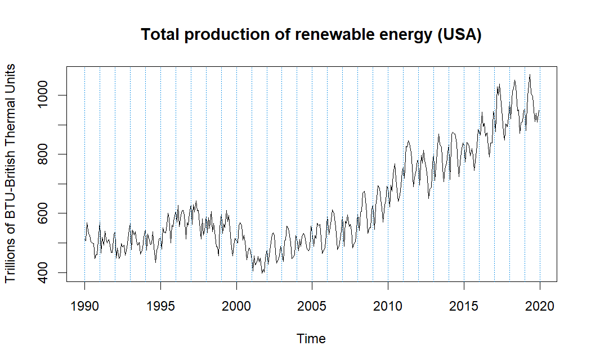
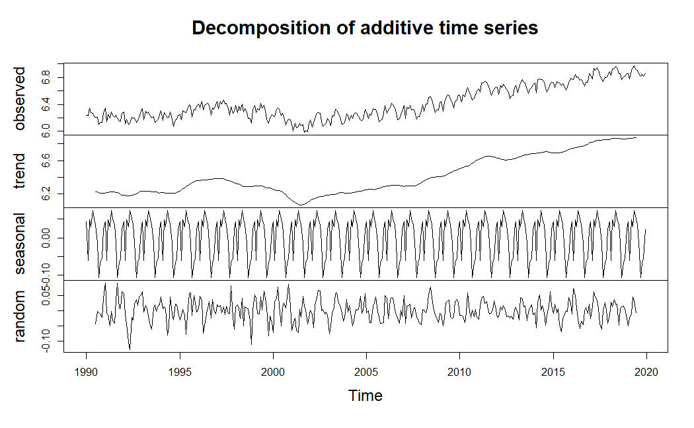
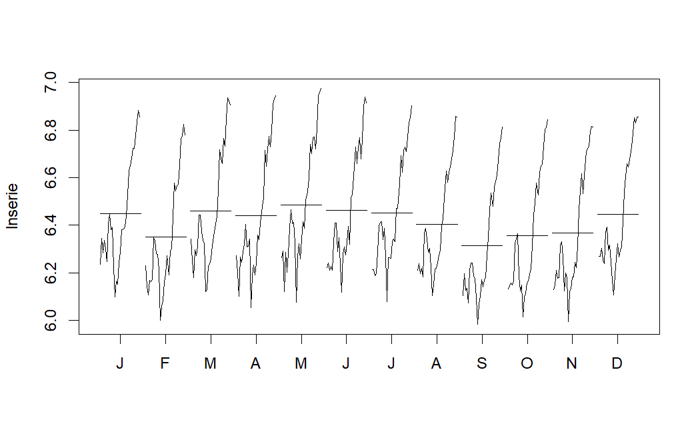
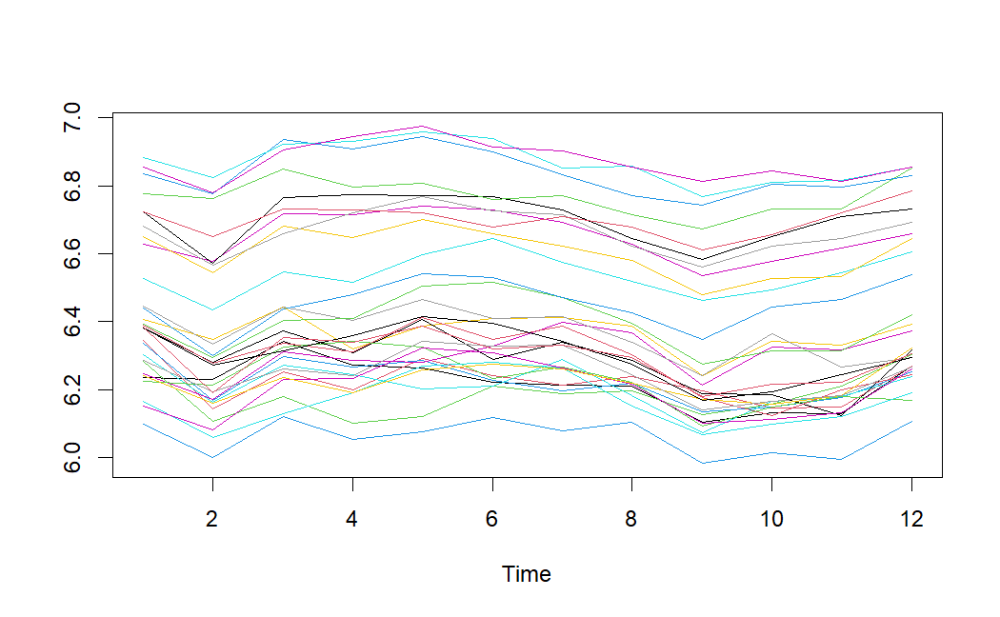
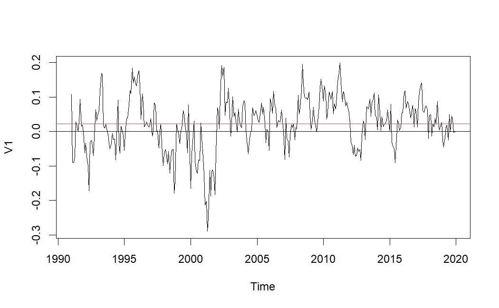
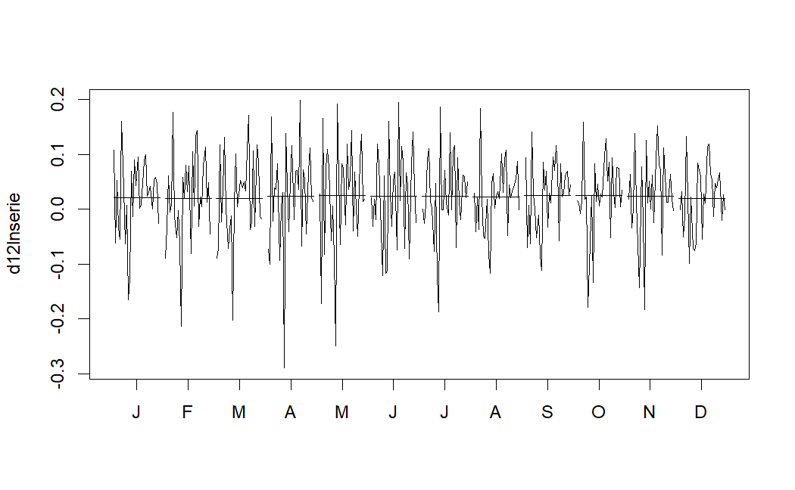
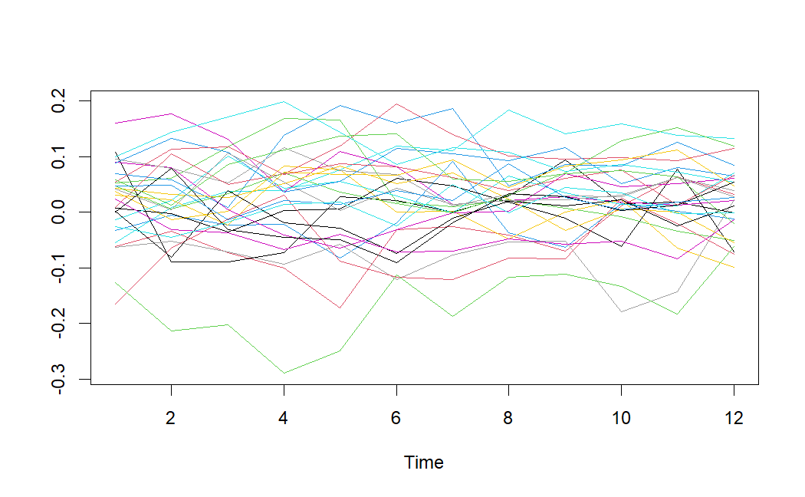

# Timeseries Analysis of Renewable Energy Total Production in USA
Project of Advanced Statistical Modelling (ASM) Course for the Master in Data Science Program of Universitat Politècnica de Catalunya (UPC)

***
## Introduction

This repository contains the [code](./timeseries.Rmd) and [data](./RenewUSA.dat) used for timeseries forecasting of renewable energy production in the USA. The project aims to analyze and predict the production of renewable energy sources using advanced statistical modeling techniques. The analysis covers data from `1990` to `2020`, sourced from the [U.S. Energy Information Administration (EIA)](https://www.eia.gov/totalenergy/data/browser/index.php?tbl=T10.01#/?f=M&start=199001&end=201901&charted=6-7-8-9-14).

## Methodology

### Data Preparation and Preliminary Analysis

1. **Data Loading**: The time series data on renewable energy production is loaded into `R`, creating a time series object with monthly data from `1990` to `2020`.
2. **Visualization**: Preliminary visual analysis is conducted to identify annual trends, variability, seasonality and the need for logarithmic transformation and regural/season differences.

    
    
    
    

### Time Series Transformation and Stationarity

1. **Log Transformation**: A logarithmic transformation is applied to stabilize the variance.
2. **Seasonal and Regular Differencing**: Seasonal differencing (`lag=12`) and regular differencing are applied to stabilize the mean and ensure stationarity.

    
    
    

### Model Identification

1. **ACF and PACF Plots**: Autocorrelation Function (ACF) and Partial Autocorrelation Function (PACF) plots are generated to guide the selection of ARIMA model parameters.
2. **Model Selection**: Various ARIMA models are proposed based on the observed lag significance in ACF and PACF plots.

### Model Estimation

1. **Parameter Estimation**: The `arima()` function is used to estimate model parameters.
2. **AIC Comparison**: Models are compared based on the Akaike Information Criterion (AIC) to select the best-fitting model.

### Model Validation

1. **Residual Analysis**: Residuals are analyzed for normality, homoscedasticity, and independence using residual plots, the Shapiro-Wilk test, and the Ljung-Box test.
2. **Diagnostic Checks**: Additional diagnostic checks are performed using the `tsdiag()` function.

### Prediction and Forecasting

1. **Forecasting**: The `predict()` function is used to generate forecasts from the selected ARIMA model.
2. **Stability Assessment**: Model stability is confirmed through similarity in coefficients and significance when trained on different data subsets.

### Outlier Detection and Treatment

1. **Outlier Detection**: Automatic detection of outliers is conducted using a criterion value of 2.8, identifying transient changes, level shifts, and additive outliers.
2. **Outlier Treatment**: Identified outliers are treated to ensure accurate forecasts and robust analysis.

### Incorporating Calendar Effects

1. **Calendar Effects**: The inclusion of calendar effects (Trading Days and Easter) is tested, but found to be non-significant, and hence not included in the final model.

### Analysis Based on Linearized Series

1. **Linearized Analysis**: Further analysis is performed based on linearized time series to enhance model interpretation and forecasting accuracy.

### Comparison of Forecasting Performance

1. **Model Comparison**: Various models are compared based on their forecasting performance, with the SARIMA(3,1,0)(0,1,1)[12] model selected for its favorable assessments.

## Results

The results of the time series analysis and forecasting are detailed in the final report. Key findings include:

- **Model Selection**: The SARIMA(3,1,0)(0,1,1)[12] model was selected for its stability and forecasting accuracy.
- **Forecasts**: Forecasts for renewable energy production from December 2018 to December 2019 were generated, demonstrating the model's effectiveness.
- **Outliers**: Several significant outliers were detected and treated to improve model robustness.

## Conclusion

The project successfully developed a robust forecasting model for renewable energy production in the USA, leveraging advanced time series analysis techniques. The selected model provides accurate predictions and insights into the trends and variability of renewable energy production.
