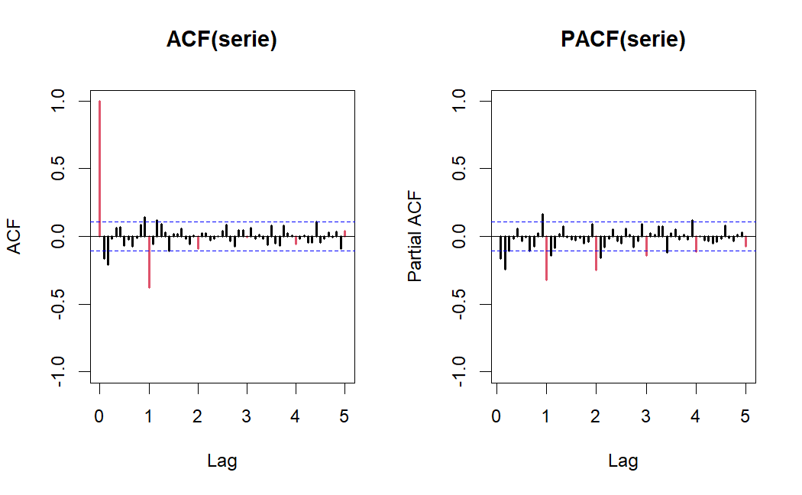
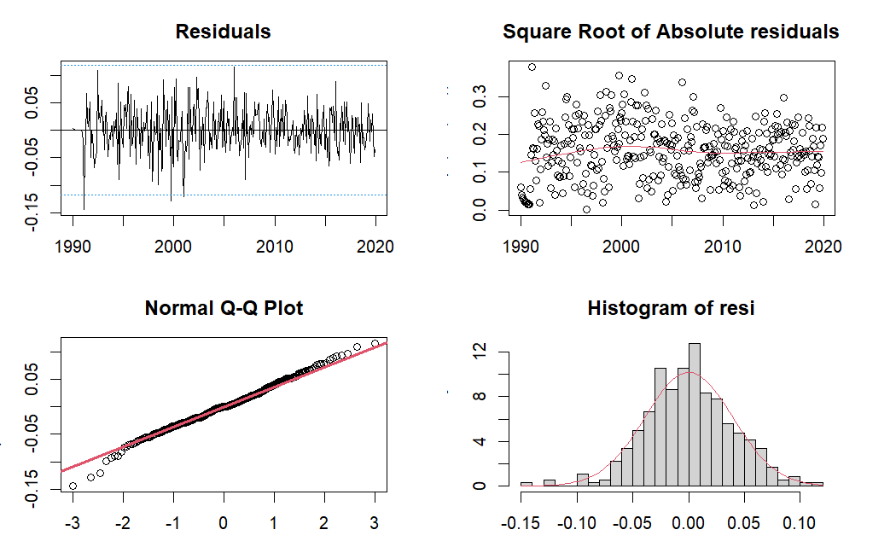
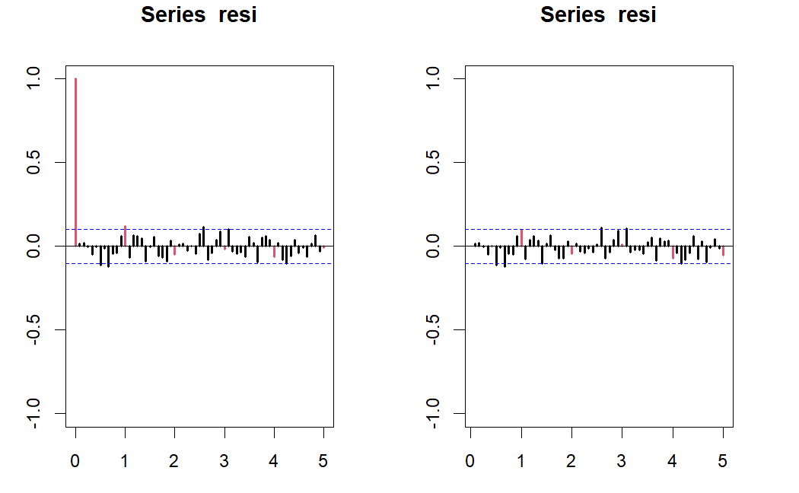
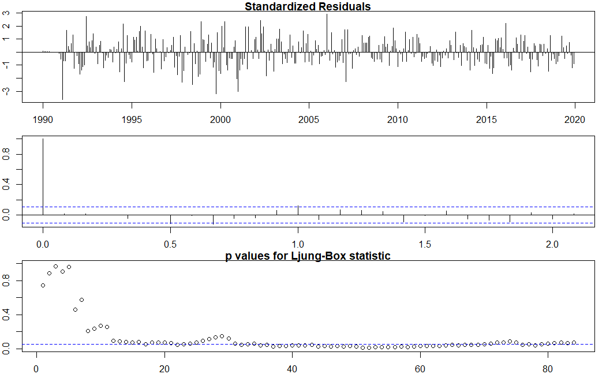
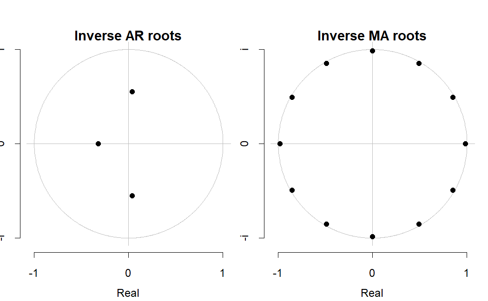
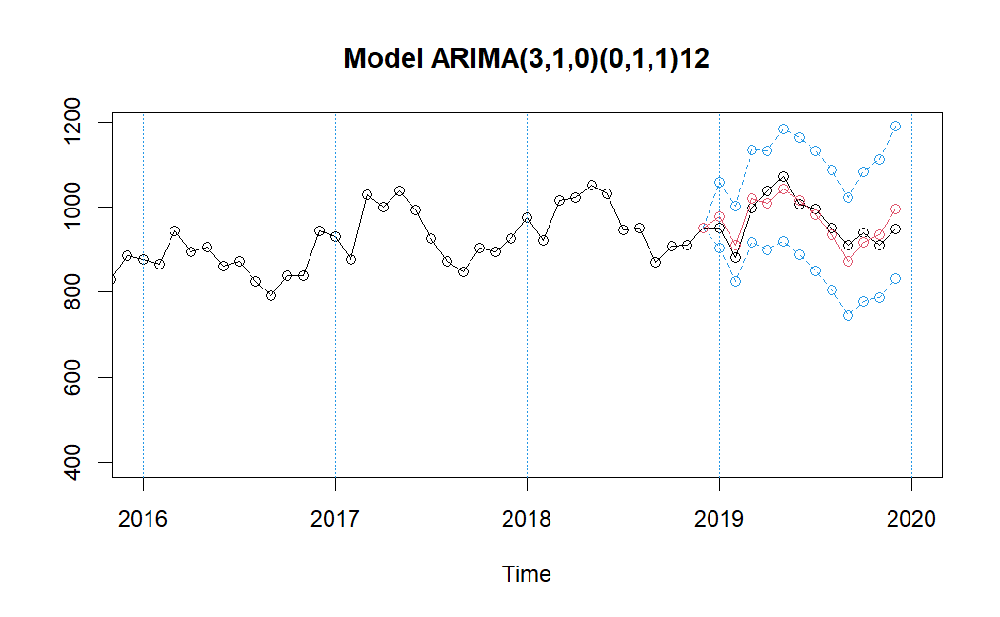
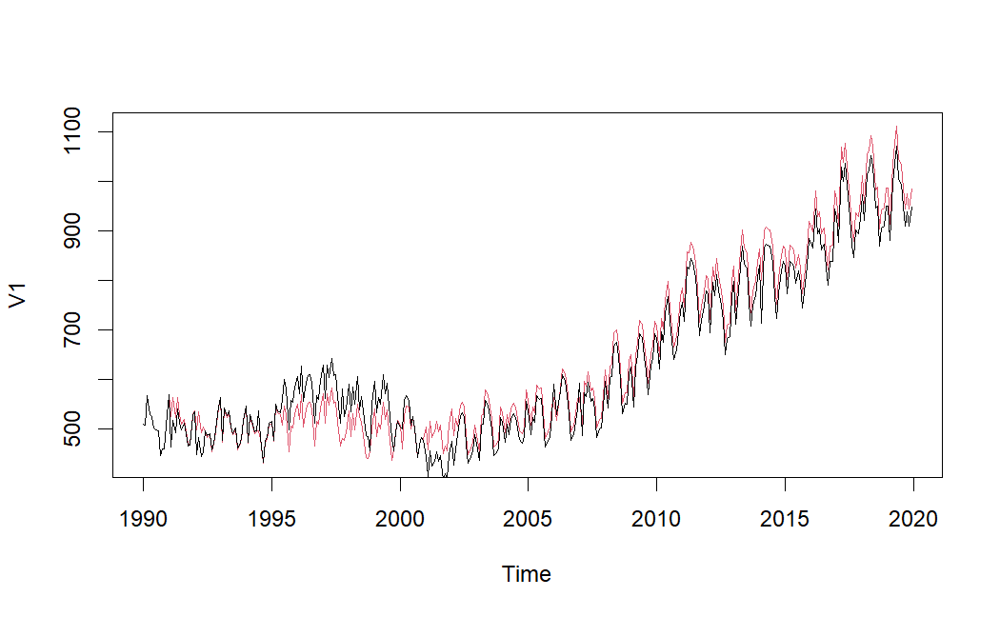
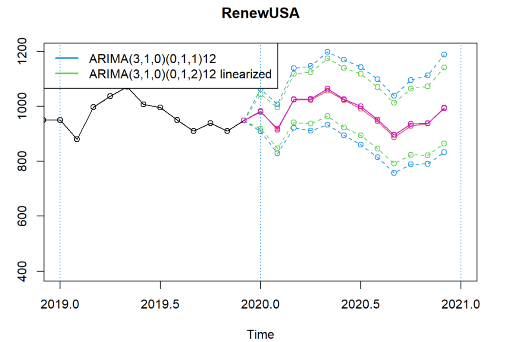

# Timeseries Analysis of Renewable Energy Total Production in USA
Project of Advanced Statistical Modelling (ASM) Course for the Master in Data Science Program of Universitat Politècnica de Catalunya (UPC)

***
## Overview

This repository contains the [code](./timeseries.Rmd) and [data](./RenewUSA.dat) used for timeseries forecasting of renewable energy production in the USA. The [project](./docs/Statement.pdf) aims to analyze and predict the production of renewable energy sources using advanced statistical modeling techniques. The analysis covers data from `1990` to `2020`, sourced from the [U.S. Energy Information Administration (EIA)](https://www.eia.gov/totalenergy/data/browser/index.php?tbl=T10.01#/?f=M&start=199001&end=201901&charted=6-7-8-9-14). Details on the implementation and explanation of analysis and results are included in the [Report Document](./docs/Report.pdf)

## Methodology

### Data Preparation and Preliminary Analysis

1. **Data Loading**: The time series data on renewable energy production is loaded into `R`, creating a time series object with monthly data from `1990` to `2020`.
2. **Visualization**: Preliminary visual analysis is conducted to identify annual trends, variability, seasonality and the need for logarithmic transformation and regural/season differences.

    
    
    
    

### Time Series Transformation and Stationarity

1. **Log Transformation**: A logarithmic transformation is applied to stabilize the variance.
2. **Seasonal and Regular Differencing**: Seasonal differencing (`lag=12`) and regular differencing are applied to stabilize the mean and ensure stationarity.

    
    
    

### Model Identification

1. **ACF and PACF Plots**: `Autocorrelation Function (ACF)` and `Partial Autocorrelation Function (PACF)` plots are generated to guide the selection of `ARIMA` model parameters.
2. **Model Selection**: Various `ARIMA` models are proposed based on the observed lag significance in ACF and PACF plots.

    

For the seasonal part (indicated by red lags), a MA(Q=1) model is preferred due to its parsimony, and for the regular part (indicated by black lags), an ARMA(1,1) model is considered. The final models proposed are as follows:

- SARIMA(0,1,2)(0,1,1)_12
- SARIMA(3,1,0)(0,1,1)_12
- SARIMA(1,1,1)(0,1,1)_12
- SARIMA(0,1,2)(4,1,0)_12
- SARIMA(3,1,0)(4,1,0)_12
- SARIMA(1,1,1)(4,1,0)_12

### Model Estimation

1. **Parameter Estimation**: The `arima()` function is used to estimate model parameters.
2. **AIC Comparison**: Models are compared based on the **Akaike Information Criterion (AIC)** to select the best-fitting model.

Upon estimation using the `R` software, several models were fitted, and the AIC was employed to compare the models. The intercept term was found to be insignificant across all models, as evidenced by a `t-ratio less than 2`, justifying its exclusion. **The lowest AIC value was observed for SARIMA(0,1,2)(0,1,1)_12, followed by SARIMA(3,1,0)(0,1,1)_12**. All parameters in the selected models were **significant**, with `t-ratios greater than 2`.

In light of these findings, further analysis using **SARIMA(0,1,2)(0,1,1)_12** and **SARIMA(3,1,0)(0,1,1)_12** as the primary models for forecasting was conducted.

#### Summary of Significant SARIMA Models

| Model                      | AIC      | Log Likelihood |
|----------------------------|----------|----------------|
| SARIMA(0,1,2)(0,1,1)_12     | -1230.79 | 619.39         |
| SARIMA(3,1,0)(0,1,1)_12     | -1228.93 | 619.46         |

### Model Validation

1. **Residual Analysis**: Residuals are analyzed for `normality`, `homoscedasticity`, and `independence` using residual plots, the `Shapiro-Wilk` test, and the `Ljung-Box` test.
2. **Diagnostic Checks**: Additional diagnostic checks are performed using the `tsdiag()` function.

The following visualizations resemble to model **SARIMA(3,1,0)(0,1,1)_12** that was performing slightly better.

- **Normality and Variance**
  - Q-Q plot and histogram suggest potential deviations from normality due to outliers.
  - **Shapiro-Wilk Test**: p-value of 0.123, indicating residuals could be normally distributed.
  - **Breusch-Pagan Test**: p-value of 0.003649, indicating potential heteroscedasticity likely influenced by outliers.

- **Invertibility and Causality**
  - `AR` characteristic polynomial roots (1.814813, 1.814813, 3.090462) and `MA` roots (repeatedly 1.017058) indicate model is both invertible and causal.
  - Allows representation in `AR(∞)` form for point predictions and `MA(∞)` form for estimating prediction variances.

- **Residuals Independence**
  - **Ljung-Box Test**: Rejects null hypothesis of no autocorrelation for lags beyond 30 (p-values < 0.05), indicating residuals do not exhibit white noise behavior.

- **Overall Model Assessment**
  - `SARIMA(3,1,0)(0,1,1)_12` model shows concerns in variance consistency and residuals independence.
  - Further investigation or model refinement recommended.
  - `Next steps`: Explore calendar effects and outliers analysis to stabilize heteroscedasticity and reduce residual autocorrelation.

### Prediction and Forecasting

1. **Forecasting**: The `predict()` function is used to generate forecasts from the selected `ARIMA` model.
2. **Stability Assessment**: Model stability is confirmed through similarity in coefficients and significance when trained on different data subsets.

The predictability power of the proposed model is presented in the following figures.

The forecasts for the period from `December 2018` to `December 2019` are as follows:

| Month    | Lower Limit | Prediction | Upper Limit | Observation | Error     | St. Error  |
|----------|-------------|------------|-------------|-------------|-----------|------------|
| Jan 2019 | 903.5681    | 977.6406   | 1057.785    | 949.921     | -27.71956 | -0.02918   |
| Feb 2019 | 824.6318    | 909.5915   | 1003.304    | 880.451     | -29.14047 | -0.03310   |
| Mar 2019 | 917.5105    | 1020.5732  | 1135.213    | 997.161     | -23.41217 | -0.02348   |
| Apr 2019 | 900.1191    | 1009.9919  | 1133.276    | 1037.089    | 27.09707  | 0.02613    |
| May 2019 | 920.4327    | 1043.5892  | 1183.224    | 1071.009    | 27.41978  | 0.02560    |
| Jun 2019 | 887.8607    | 1016.1353  | 1162.942    | 1007.147    | -8.98829  | -0.00892   |
| Jul 2019 | 850.3172    | 981.1332   | 1132.075    | 995.467     | 14.33376  | 0.01440    |
| Aug 2019 | 804.6839    | 935.6843   | 1088.011    | 949.779     | 14.09470  | 0.01484    |
| Sep 2019 | 745.2073    | 873.0664   | 1022.863    | 909.946     | 36.87957  | 0.04053    |
| Oct 2019 | 777.9459    | 917.9930   | 1083.252    | 938.857     | 20.86401  | 0.02222    |
| Nov 2019 | 786.9901    | 935.0376   | 1110.935    | 909.319     | -25.71855 | -0.02828   |
| Dec 2019 | 832.6452    | 995.8052   | 1190.937    | 948.992     | -46.81322 | -0.04933   |

*Table 2: Predictions and observed values for SARIMA(3,1,0)(0,1,1)12 model from December 2018 to December 2019 along with the associated prediction error and standardized error.*

The Root Mean Square Error (RMSE), Mean Absolute Error (MAE), Root Mean Square Percentage Error (RMSPE), and Mean Absolute Percentage Error (MAPE) were calculated to assess the model’s performance. The results are as follows:

| Metric | Value   |
|--------|---------|
| RMSE   | 27.057  |
| MAE    | 25.207  |
| RMSPE  | 0.02845 |
| MAPE   | 0.02633 |

*Table 3: Performance metrics for SARIMA(3,1,0)(0,1,1)_12 predictions from December 2018 to December 2019.*

Finally, the `mean length of the confidence interval (CI)` was also calculated to be **242.4543**, indicating the average range within which the future values are expected to fall with **95%** confidence. Finally, below are the predictions on year `2020`:

| Month    | Lower Limit | Prediction | Upper Limit |
|----------|-------------|------------|-------------|
| Dec 2019 | 948.9920    | 948.9920   | 948.9920    |
| Jan 2020 | 908.5050    | 982.2506   | 1061.9820   |
| Feb 2020 | 828.9798    | 913.7986   | 1007.2960   |
| Mar 2020 | 920.9431    | 1023.7587  | 1138.0530   |
| Apr 2020 | 911.4797    | 1021.9953  | 1145.9110   |
| May 2020 | 932.8905    | 1056.8515  | 1197.2840   |
| Jun 2020 | 894.3326    | 1022.6818  | 1169.4510   |
| Jul 2020 | 859.9803    | 991.4180   | 1142.9440   |
| Aug 2020 | 813.8822    | 945.5079   | 1098.4210   |
| Sep 2020 | 757.5029    | 886.6130   | 1037.7290   |
| Oct 2020 | 788.1025    | 929.0435   | 1095.1900   |
| Nov 2020 | 789.9290    | 937.5524   | 1112.7640   |
| Dec 2020 | 832.6554    | 994.7440   | 1188.3850   |

*Table 5: Prediction intervals for SARIMA(3,1,0)(0,1,1)_12 model for the year `2020`.*

### Incorporating Calendar Effects

The inclusion of **Calendar Effects** (`Trading Days and Easter`) is tested, but found to be non-significant, and hence not included in the final model.

An analysis was conducted to assess the potential influence of calendar effects, specifically `Trading Days and Easter`, on the log-transformed series within the **SARIMA(3,1,0)(0,1,1)_12** model framework. The coefficients introduced for Trading Days and Easter, denoted as (`w_{TradDays}`) and (`w_{East}`), respectively, exhibited t-ratios less than the threshold of 2, indicating their non-significance.

Furthermore, the incorporation of these variables did not lead to any appreciable enhancement in the model’s AIC score. The detailed model output is summarized in `Table 6`.

| Model        | ar1     | ar2     | ar3     | sma1    | Calendar Effect          | AIC       |
|--------------|---------|---------|---------|---------|--------------------------|-----------|
| Base         | -0.2531 | -0.2808 | -0.0982 | -0.8163 | -                        | -1228.93  |
| TD           | -0.2486 | -0.2826 | -0.1022 | -0.8148 | w_{TradDays} 0.0006 | -1228.45  |
| Easter       | -0.2526 | -0.2787 | -0.1011 | -0.8166 | w_{East} -0.0050   | -1227.42  |
| TD + Easter  | -0.2483 | -0.2808 | -0.1043 | -0.8151 | w_{TradDays} 0.0006, w_{East} -0.0043 | -1226.82  |

*Table 6: Model comparisons with calendar effects for SARIMA(3,1,0)(0,1,1)_12 model*

Given the lack of significance of the calendar effect coefficients, the time series is determined not to be impacted by these factors. Hence, the `SARIMA(3,1,0)(0,1,1)_12` model without calendar effects will be retained for further analysis.

### Outlier Detection and Treatment

To ensure the accuracy of forecasts and robustness of analysis, the automatic detection and treatment of outliers were applied to the time series data. The following steps were undertaken:

1. **Differentiation**:
   - Regular and seasonal differentiation of order (S = 12) was applied.

2. **Criterion for Outlier Detection**:
   - The criterion value was set to (crit = 2.8).
   - Level shift detection was enabled.

3. **Residual Variance**:
   - The residual variance after outliers treatment was estimated as `0.001006418`.

4. **Identified Outliers**:
   - Several outliers were detected in the time series data. These are summarized in `Table 7`.

| Obs  | Type | W_coeff | ABS_L_Ratio | Date      | % Obs    |
|------|------|---------|-------------|-----------|----------|
| 14   | TC   | -0.1214 | 3.6050      | Feb 1991  | 88.57%   |
| 26   | LS   | -0.1015 | 3.2171      | Feb 1992  | 90.35%   |
| 30   | LS   | 0.1079  | 3.3739      | Jun 1992  | 111.40%  |
| 55   | AO   | 0.0718  | 3.0038      | Jul 1994  | 107.44%  |
| 66   | LS   | 0.0893  | 2.9839      | Jun 1995  | 109.34%  |
| 94   | AO   | 0.0919  | 3.3350      | Oct 1997  | 109.63%  |
| 102  | AO   | -0.0716 | 2.9585      | Jun 1998  | 93.09%   |
| 107  | AO   | -0.0948 | 3.3868      | Nov 1998  | 90.96%   |
| 118  | LS   | -0.1011 | 3.2503      | Oct 1999  | 90.39%   |
| 122  | TC   | 0.0869  | 2.9601      | Feb 2000  | 109.08%  |
| 133  | LS   | -0.1219 | 3.5715      | Jan 2001  | 88.53%   |
| 148  | LS   | 0.0892  | 2.9444      | Apr 2002  | 109.33%  |
| 193  | TC   | 0.0854  | 2.9449      | Jan 2006  | 108.92%  |
| 205  | AO   | 0.0840  | 3.2287      | Jan 2007  | 108.76%  |
| 290  | AO   | -0.0758 | 3.0054      | Feb 2014  | 92.70%   |

*Table 7: Detected Outliers and their Characteristics*

**Notes**:
- **TC**: Transient Change
- **LS**: Level Shift
- **AO**: Additive Outlier

### Analysis Based on Linearized Series

The **linearized time series** was obtained after adjusting for the detected outliers. The resulting timeseries together with the outliers profile is presented as follows:

The `Model Identification` and `Model Validation` processes for the linearized time series were then applied again. The final model taken into account the outliers by using the linearized timeseries was **SARIMA(3,1,0)(0,1,2)_12** again.

## Comparison of Original and Linearized Model

After having validated and performed forecasting in the linearized model, we compare the capability of prediction of the `2` final models, which are the chosen models with and without treatment of outliers.

The summary of statistics between the two models and their predictions are showcased below:

| Model                          | AIC       | BIC       | RMSE      | MAE       | RMSPE      | MAPE       | meanLength  |
|--------------------------------|-----------|-----------|-----------|-----------|------------|------------|-------------|
| SARIMA(3,1,0)(0,1,1)_12        | -1228.926 | -1209.680 | 27.05704  | 25.20676  | 0.02845077 | 0.02633460 | 242.4543    |
| SARIMA(3,1,0)(0,1,2)_12 Linearized | -1337.038 | -1256.203 | 27.68585  | 25.21872  | 0.02941481 | 0.02646803 | 191.2267    |

*Table 10: Summary statistics for final SARIMA models.*
